# PingWatch — Multi-Tenant, Event-Driven Uptime & Incident Management Platform

> An enterprise-grade, multi-tenant SaaS platform for infrastructure availability, performance monitoring, automated incident detection, multi-channel escalation policies, and public status pages.

---

## 📋 Table of Contents

- [Product Overview](#-product-overview)
- [Primary Personas & Target Audience](#-primary-personas--target-audience)
- [Key Differentiators](#-key-differentiators)
- [Core User Flows](#-core-user-flows)
- [High-Level System Architecture](#-high-level-system-architecture)
- [Component Architecture & Modular Monolith](#-component-architecture--modular-monolith)
- [Background Workers & Multi-Region Consensus](#-background-workers--multi-region-consensus)
- [Queue & Pub/Sub Architecture](#-queue--pubsub-architecture)
- [Incident Detection & Multi-Region Quorum](#-incident-detection--multi-region-quorum)
- [Alert Fan-out & Escalation Engine](#-alert-fan-out--escalation-engine)
- [Multi-Tenant Data Isolation & Security](#-multi-tenant-data-isolation--security)
- [Authentication & RBAC](#-authentication--rbac)
- [Database Schema & Data Models](#-database-schema--data-models)
- [Caching Strategy & API Gateway](#-caching-strategy--api-gateway)
- [WebSocket Real-Time Architecture](#-websocket-real-time-architecture)
- [Public Status Page Architecture](#-public-status-page-architecture)
- [Infrastructure, Kubernetes & CI/CD](#-infrastructure-kubernetes--cicd)
- [Observability & Self-Monitoring](#-observability--self-monitoring)
- [Disaster Recovery & Cost Optimization](#-disaster-recovery--cost-optimization)
- [Monorepo Structure](#-monorepo-structure)
- [Tech Stack Mapping](#-tech-stack-mapping)
- [Scalability Roadmap](#-scalability-roadmap)
- [Local Development & Quickstart](#-local-development--quickstart)

---

## 🎯 Product Overview

**PingWatch** is an event-driven, multi-tenant monitoring and incident response platform (in the class of *BetterUptime*, *Checkly*, and *UptimeRobot*). It enables engineering teams to track availability, performance, and correctness across their infrastructure target types:

- **HTTP / REST APIs** (status codes, response latency, payload assertions, custom headers)
- **TCP Ports & DNS Resolution**
- **SSL / TLS Certificate Monitoring** (expiry warnings, chain validation)
- **Heartbeat & Cron Job Monitoring** (dead-man switch)
- **Browser Synthetic Checks**

---

## 👤 Primary Personas & Target Audience

| Persona | Core Need | Key Feature Value |
| :--- | :--- | :--- |
| **SRE / DevOps Engineer** | Fast incident detection, low false-positive rate, deep diagnostics | Multi-region quorum consensus, latency histograms, flame graphs |
| **Engineering Manager** | SLA/SLO reporting, MTTR/MTBF metrics, postmortem analysis | Automated uptime reporting, AI-generated Incident Postmortems |
| **Founder / Small Team** | Cheap, reliable uptime checks + public status page | Quick monitor setup, low overhead, hosted status pages |
| **End Customer** | Real-time visibility into vendor service status | Edge-cached public status pages, email/RSS incident subscriptions |

---

## ✨ Key Differentiators

1. **Multi-Region Consensus Checking**: Prevents false alarms caused by single probe network blips by requiring regional quorum consensus before declaring an outage.
2. **AI Incident Assistant & Postmortem Generator**: Automatically generates root-cause analysis drafts and postmortem reports using LLM integrations upon incident resolution.
3. **High-Throughput Decoupled Architecture**: Request path (Dashboard CRUD) is strictly decoupled from the check-execution path via Redis queues and Pub/Sub streams.
4. **Public Status Pages with ISR & Edge Caching**: Resilient public status pages designed to withstand 100x traffic spikes during active outages.

---

## 🔄 Core User Flows

```mermaid
flowchart TD
    subgraph FlowA["Flow A — Monitor Creation"]
        A1[User Signs Up / Log In] --> A2[Org auto-created & Member Invited]
        A2 --> A3[User Creates Monitor]
        A3 --> A4[API Validates & Persists]
        A4 --> A5[Scheduler Registers Job]
        A5 --> A6[First Check Runs in Seconds]
    end

    subgraph FlowB["Flow B — Incident & Escalation"]
        B1[Worker Check Fails in N Regions] --> B2[Quorum Breached]
        B2 --> B3[Incident Engine Opens Incident]
        B3 --> B4[Alert Fan-out via Escalation Policy]
        B4 --> B5[Status Page Auto-Updates]
        B5 --> B6[Recovery Auto-Resolves & Generates AI Postmortem]
    end
```

### 1. Flow A — Create a Monitor
1. User signs up $\rightarrow$ Organization (tenant) auto-created $\rightarrow$ invited to Team.
2. User configures a Monitor (URL, method, interval, global check regions, HTTP assertions).
3. API validates inputs and persists config to Database $\rightarrow$ Scheduler registers a recurring job in BullMQ.
4. First check executes within seconds; dashboard updates from `PENDING` $\rightarrow$ `UP`/`DOWN`.

### 2. Flow B — Incident & Escalation Lifecycle
1. Worker check fails $N$ consecutive times (configurable threshold) across a **quorum of regions**.
2. Incident Engine opens an `Incident`, assigns severity (`MINOR`, `MAJOR`, `CRITICAL`), and triggers the assigned escalation policy.
3. Alerts fan out to designated channels (Slack, Email, SMS, Webhooks) according to the on-call schedule.
4. Public Status Page auto-updates to `Degraded` or `Down`.
5. Upon target recovery, Incident Engine auto-resolves the incident, calculates MTTR/MTBF, and drafts an AI postmortem report.

### 3. Flow C — Public Status Page Visit
1. Anonymous visitor hits `status.customer.com` (Custom CNAME) or `pingwatch.app/status/{slug}`.
2. Edge CDN renders cached uptime history and active incident updates.
3. Visitor can subscribe to incident updates via Email, RSS, or Webhooks.

### 4. Flow D — Team Collaboration & RBAC
1. Workspace Owner invites members and assigns granular roles (`OWNER`, `ADMIN`, `EDITOR`, `VIEWER`).
2. Audit log records every mutating action for compliance (SOC2 requirement).

---

## 🏗️ High-Level System Architecture

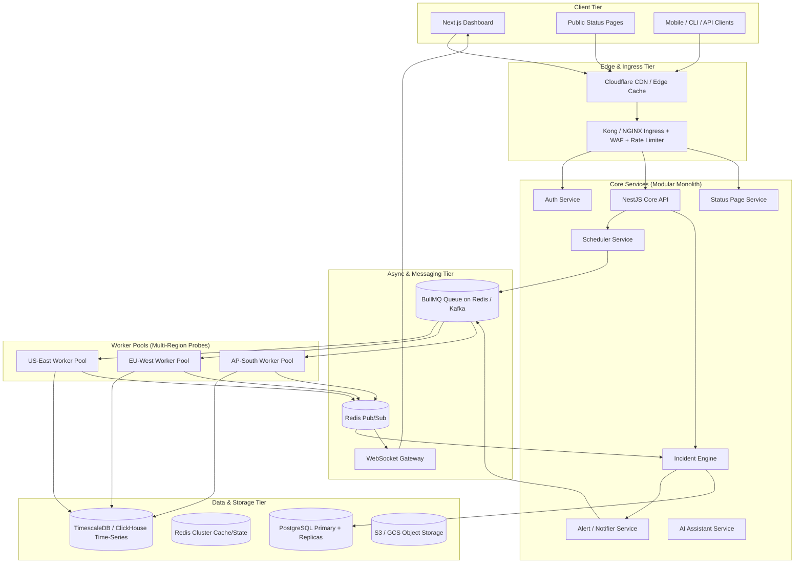

> **Design Rationale**: Everything is decoupled through Redis (pub/sub + queues). The API request path for CRUD operations never blocks on check executions. Workers scale horizontally per geographic region independently of the core control plane.

---

## 🧩 Component Architecture & Modular Monolith

PingWatch starts as a **Modular Monolith** inside NestJS with strict module boundaries. Each module represents a bounded context and owns its Prisma models. No cross-module repository access is permitted; communication occurs via explicit module interfaces.

```
apps/api/src/modules/
├── auth/             # Authentication, JWT rotation, OAuth, SAML
├── organizations/    # Tenants, memberships, team invites, RBAC
├── monitors/         # Monitor CRUD, check configurations
├── incidents/        # Incident state engine & MTTR analytics
├── alerts/           # Escalation policies & notification channels
├── status-pages/     # Public status pages & subscriber delivery
├── billing/          # Tier quotas, usage metering, Stripe hooks
└── audit/            # SOC2 compliant mutation audit logging
```

When scaling limits are reached, bounded contexts can be extracted into independent microservices (`auth-svc`, `monitor-svc`, `incident-svc`, `notifier-svc`) without code rewrites—simply cutting module boundaries at the network transport layer.

---

## 🌐 Background Workers & Multi-Region Consensus

Workers are stateless execution nodes responsible for executing probes (HTTP requests, TCP sockets, DNS resolution, TLS connection checks).

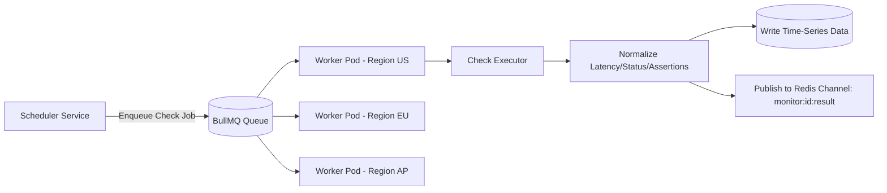

### Key Design Decisions
- **Stateless & Scalable**: Workers pull jobs from BullMQ and autoscale via **KEDA** based on queue depth rather than CPU utilization.
- **Geographic Pinning**: Regional worker deployments are pinned via Kubernetes `nodeSelector` / `topologySpreadConstraints` to geographic cloud regions.
- **Minimal Payload**: Jobs contain only lightweight monitor IDs and embedded config snapshots. Workers do not perform DB reads during execution.
- **Jittered Scheduling**: Cron schedules apply a random offset ($\pm 10\%$ of check interval) to prevent thundering herd spikes on exact minute boundaries.

---

## ⚡ Queue & Pub/Sub Architecture

PingWatch employs a **dual-messaging pattern** using Redis:

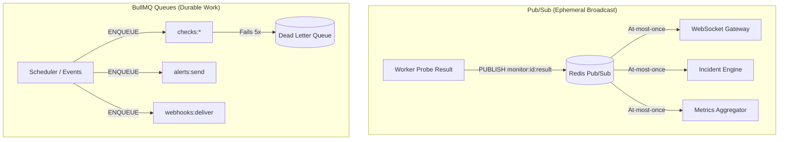

- **Redis Pub/Sub**: Handles live dashboard updates and real-time incident detection (ephemeral, at-most-once delivery).
- **BullMQ Queues**: Handles durable background tasks (check dispatch, email alerts, webhooks, report generation) with automatic exponential backoff retries and Dead Letter Queue (DLQ) tracking.

---

## 🛡️ Incident Detection & Multi-Region Quorum

To eliminate false positives caused by local network glitches, PingWatch enforces **Multi-Region Quorum Consensus**:

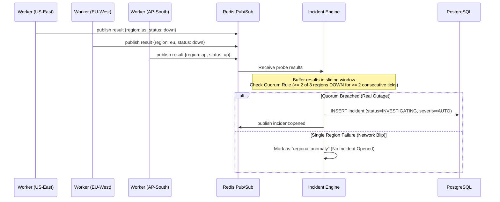

---

## 📢 Alert Fan-out & Escalation Engine

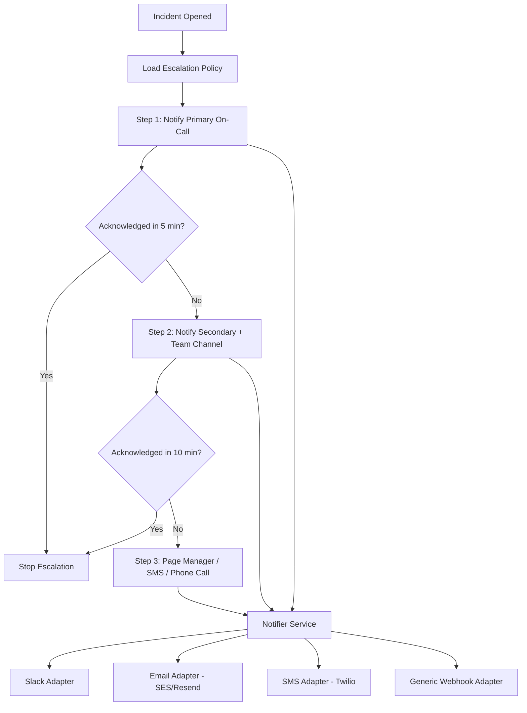

- **Delayed BullMQ Jobs**: Escalation timers are executed as delayed BullMQ jobs (`delay: 5*60*1000`) that auto-cancel if an acknowledgment event is registered first.
- **Quiet Hours & Alert Grouping**: Flapping alerts are batched into digest notifications during configured quiet windows.

---

## 🔒 Multi-Tenant Data Isolation & Security

PingWatch guarantees multi-tenant isolation using a **two-layer defense-in-depth model** ("Belt & Suspenders"):

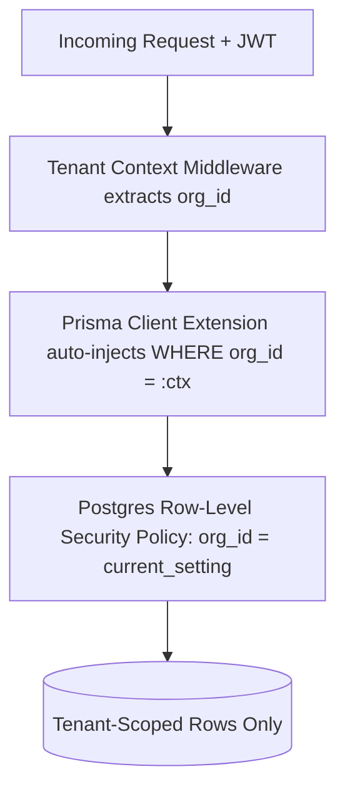

1. **Application Layer**: A Prisma extension automatically injects `WHERE org_id = :ctx` into every database query, preventing accidental data leaks.
2. **Database Layer (RLS)**: Postgres Row-Level Security policies enforce `org_id = current_setting('app.current_org_id')` per transaction, guaranteeing isolation even if application-level checks fail.
3. **Outbound SSRF Protection**: Check execution workers execute outbound requests from an isolated network segment with egress rules blocking internal IPs (`169.254.169.254`, `RFC1918` ranges).
4. **Webhook Security**: Outbound webhooks include HMAC-SHA256 signatures (`X-PingWatch-Signature`) for verification.

---

## 🔑 Authentication & RBAC

- **Authentication Methods**: Email/Password (argon2 hashing), OAuth (Google/GitHub), Enterprise SAML/SSO via WorkOS, optional TOTP MFA.
- **Session Model**: Short-lived Access JWT (15-min expiry) + rotating Refresh Token stored in secure `httpOnly` cookies.
- **Role-Based Access Control (RBAC)**: Enforced per organization via NestJS `@Roles()` decorators and `RolesGuard`:
  - `OWNER`: Full administrative access, billing, workspace deletion.
  - `ADMIN`: User management, monitor management, escalation policies.
  - `EDITOR`: Create, edit, pause, and delete monitors and alert channels.
  - `VIEWER`: Read-only access to dashboards, incident histories, and reports.
- **API Keys**: Scoped tokens (`monitors:read`, `monitors:write`, `incidents:read`) stored as SHA-256 hashes at rest for automated CI/CD pipelines.

---

## 📊 Database Schema & Data Models

The relational data model is managed via Prisma in [packages/database](file:///d:/Tamanna/pingwatch/packages/database).

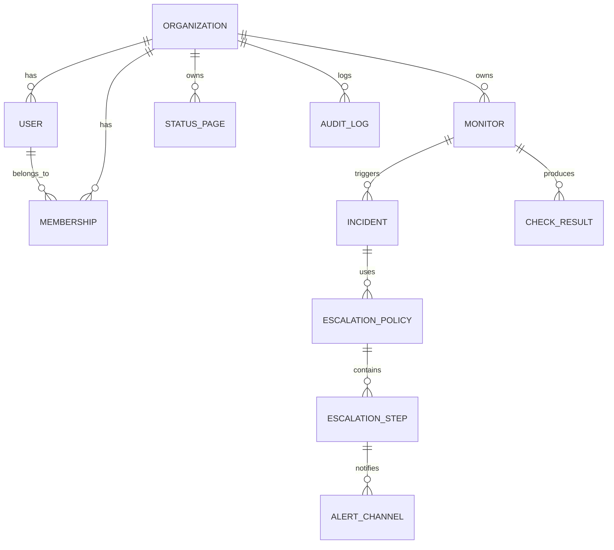

> **Note**: `CHECK_RESULT` is high-throughput, append-only time-series data. In production, check results are written directly to a **TimescaleDB hypertable** or **ClickHouse** cluster rather than standard PostgreSQL tables, leveraging continuous aggregates for 30/60/90-day uptime calculations.

---

## ⚡ Caching Strategy & API Gateway

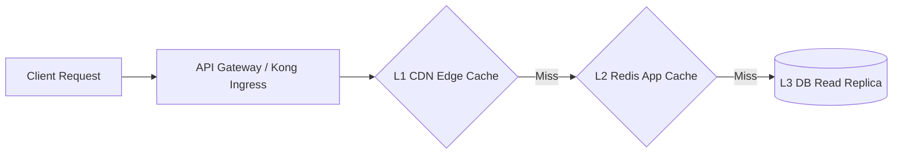

- **L1 CDN Cache**: Edge-caches public status pages with 30-60s TTL and instant on-demand revalidation hooks on incident updates.
- **L2 Redis Cache**: Short-TTL (30s) tenant-scoped JSON cache for monitor configurations and user dashboards with explicit cache-busting write-through invalidation.
- **Cache Stampede Protection**: Employs distributed `SET NX PX` locks when recomputing cold cache keys.
- **API Gateway Features**: TLS termination, OWASP WAF rules, token bucket rate-limiting, CORS, and request routing.

---

## 🔌 WebSocket Real-Time Architecture

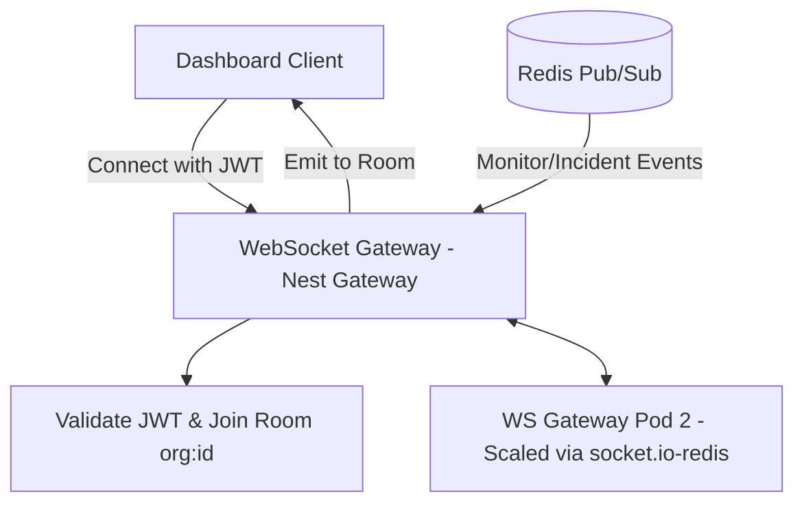

WebSocket nodes utilize the `socket.io-redis` adapter so events published anywhere on the backend propagate to connected frontend clients seamlessly across horizontally scaled gateway instances.

---

## 🖼️ Public Status Page Architecture

- **High Availability**: Built with Next.js Incremental Static Regeneration (ISR) and server components to withstand extreme traffic during major outages.
- **Database Load Isolation**: All status page queries target read replicas and TimescaleDB pre-computed rollups, protecting the primary database.
- **Custom Domains**: Supports custom domain CNAME routing with automated TLS certificate generation via Let's Encrypt / Cloudflare for SaaS.

---

## 🚀 Infrastructure, Kubernetes & CI/CD

```mermaid
flowchart LR
    PR[Pull Request] --> LINT[Lint & Typecheck]
    LINT --> UNIT[Unit Tests]
    UNIT --> INTEGRATION[Integration Tests - Testcontainers]
    INTEGRATION --> BUILD[Build Docker Images]
    BUILD --> SCAN[Trivy Vulnerability Scan]
    SCAN --> PUSH[Push Image to ECR/GHCR]
    PUSH --> ARGO[Deploy to Staging via ArgoCD]
    ARGO --> E2E[Playwright E2E Tests]
    E2E --> CANARY[Argo Rollouts Progressive Delivery]
```

- **Stateless Kubernetes Application Tier**: Web dashboards, core NestJS API, WebSocket gateways, and background workers run in Kubernetes.
- **Autoscaling**: Workers autoscale dynamically via **KEDA** based on pending BullMQ queue depth.
- **Leader Election**: Scheduler runs a single active leader instance managed via Kubernetes leases or Redis locks.
- **GitOps Pipeline**: Automated deployments powered by ArgoCD with progressive canary rollouts via Argo Rollouts.

---

## 📈 Observability & Self-Monitoring

- **OpenTelemetry Everywhere**: Distributed tracing, metrics, and structured logs unified through an OpenTelemetry Collector.
- **Observability Stack**: Prometheus for metric storage, Grafana for visual dashboards, Loki for log aggregation, and Tempo/Jaeger for trace analysis.
- **Dogfooding ("PingWatch on PingWatch")**: PingWatch monitors its own health using a completely isolated secondary instance in an independent cloud region to detect control plane failures.

---

## 💰 Disaster Recovery & Cost Optimization

### Disaster Recovery Targets

| Component | RPO | RTO | DR Strategy |
| :--- | :--- | :--- | :--- |
| **Postgres Primary** | $< 5$ min | $< 15$ min | Multi-AZ synchronous replica, automated failover, WAL archiving |
| **Redis Cache/State** | Seconds | $< 5$ min | Redis Cluster with replicas; jobs re-derivable from Postgres |
| **TimescaleDB (Metrics)**| Best-effort | $< 30$ min | Continuous automated backups; historical metric retention |
| **Full Cloud Outage** | $< 1$ hour | $< 4$ hours | Warm standby secondary region; Terraform automated runbooks |

### Cost Optimization Strategies
- **Spot / Preemptible Nodes**: Worker pools run on cheap spot instances (check failures auto-retry).
- **KEDA Scale-to-Zero**: Low-frequency background worker queues scale down to zero when idle.
- **Tiered Metric Storage**: Hot time-series metrics (7 days) stored on SSDs; historical data compressed to object storage using Timescale native compression (90%+ savings).

---

## 📁 Monorepo Structure

```
pingwatch/
├── apps/
│   ├── client/               # React + TypeScript Vite dashboard
│   ├── server/               # NestJS core API (Auth, Orgs, Monitors, Incidents)
│   ├── worker/               # Regional check execution workers
│   ├── scheduler/            # BullMQ repeatable job dispatching
│   ├── notifier/             # Alert channel adapters & escalation engine
│   └── ws-gateway/           # Scalable WebSocket real-time gateway
├── packages/
│   ├── database/             # Prisma schema, migrations & generated client
│   ├── shared-types/         # Shared Zod schemas, DTOs & TypeScript types
│   ├── config/               # Shared environment variables & validation
│   ├── observability/        # OpenTelemetry tracing & metrics setup
│   └── ui/                   # Shared UI components & design system
├── infra/
│   ├── docker/               # Multi-stage production Dockerfiles
│   ├── k8s/                  # Helm charts, KEDA ScaledObjects & ArgoCD manifests
│   └── terraform/            # Infrastructure-as-code cloud definitions
├── docker-compose.yml        # Local development stack (Postgres + Redis)
├── turbo.json                # Turborepo build pipeline configuration
└── package.json              # Monorepo root dependencies & pnpm scripts
```

---

## 🛠️ Tech Stack Mapping

| Layer | Choice | Rationale |
| :--- | :--- | :--- |
| **Frontend** | React / Next.js 15, TypeScript, TanStack Query, TailwindCSS | Fast RSC dashboards, ISR for status pages |
| **Backend API** | NestJS (TypeScript) | Modular Clean Architecture, easy microservice extraction |
| **ORM & DB** | Prisma + PostgreSQL | Type-safe queries, RLS integration, migration tooling |
| **Time-Series** | TimescaleDB / ClickHouse | Optimized for high-throughput check result rollups |
| **Queue & Cache** | Redis Cluster + BullMQ | Ephemeral Pub/Sub & durable background job processing |
| **Realtime** | Socket.io + Redis Adapter | Horizontally scalable WebSocket rooms per tenant |
| **Observability** | OpenTelemetry, Prometheus, Grafana, Loki | Vendor-agnostic full-stack metrics, traces, and logs |
| **AI Features** | Claude API (Sonnet / Haiku) | Incident summary generation and automated RCA postmortems |

---

## 🗺️ Scalability Roadmap

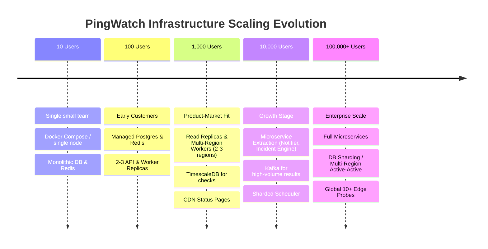

---

## 💻 Local Development & Quickstart

### Prerequisites
- **Node.js**: `v20.x` or higher
- **Package Manager**: `pnpm` (`v9.x`)
- **Docker**: Docker Desktop or Docker Engine (for local Postgres & Redis containers)

### Step-by-Step Setup

```bash
# 1. Clone the repository
git clone https://github.com/tamanna-singh02/pingwatch.git
cd pingwatch

# 2. Install dependencies across the monorepo
pnpm install

# 3. Start local PostgreSQL and Redis containers
pnpm docker:up

# 4. Set up environment variables
cp packages/database/.env.example packages/database/.env
cp apps/server/.env.example apps/server/.env
cp apps/client/.env.example apps/client/.env

# 5. Generate Prisma Client and apply database migrations
pnpm db:generate
pnpm db:migrate

# 6. Start development servers
# Terminal 1: Backend NestJS API (http://localhost:3001/api)
pnpm dev:server

# Terminal 2: Frontend Dashboard (http://localhost:5173)
pnpm dev:client
```

Open [http://localhost:5173/signup](http://localhost:5173/signup) to create your first tenant account. The signup process auto-creates your Organization and grants your user the `OWNER` role.

---

## 📄 License

Distributed under the MIT License. See `LICENSE` for details.
